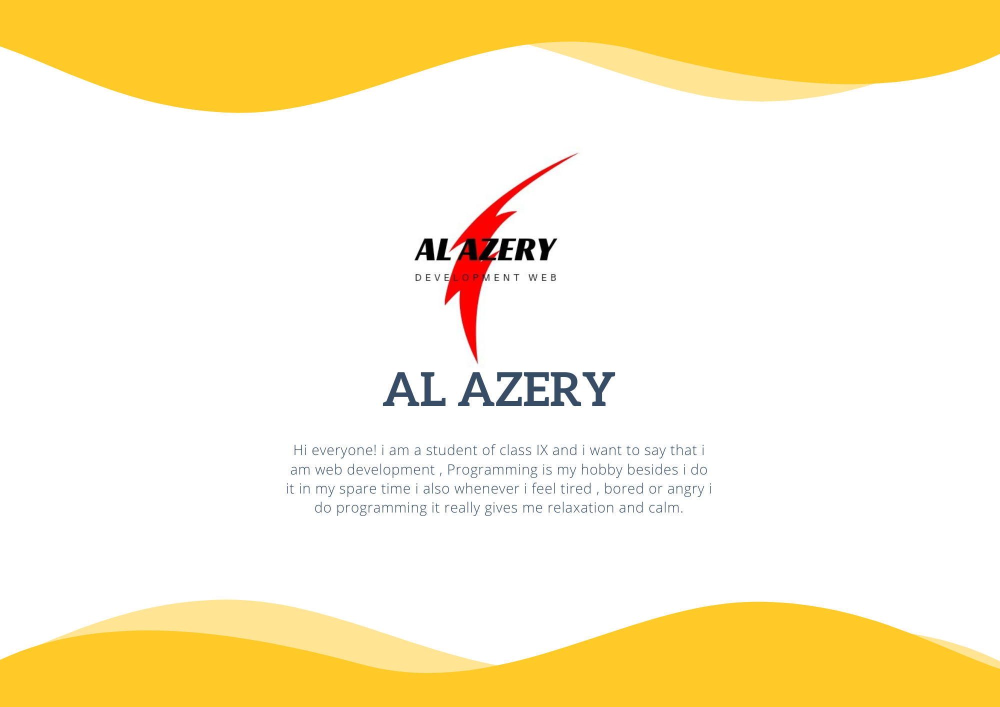

## <center>Hi, I'm Al azery<center>


<p align="center">
	<a href="https://github.com/Alazery"></a>
	<a href="https://twitter.com/TerryTangYuan"></a>
	<a href="https://github.com/sponsors/AlAzery"></a>
	<a href="https://alazery.github.io/profile"></a>
</p>

<p align="center">
   Hi everyone! i am a student of class IX and i want to say that i am web development , Programming is my hobby besides i do it in my spare time i also whenever i feel tired , bored or angry i do programming it really gives me relaxation and calm.
</p>

```python
   granted = False
def grant():
    global granted
    granted = True
def login(name,password):
    success = False
    file = open("db.txt","r")
    for i in file:
         a,b = i.split(",")
         b = b.strip()
         if(a==name and b==password):
             success = True
             break
    file.close()
    if(success):
        print("Login Successful")
        grant()
    else:
        print("wrong user name or password")
        
def register(name,password):
    file = open("db.txt","a")
    file.write("\n"+name+","+password)
    grant()
def access(option):
    global name
    if(option=="1"):
        name = input("Enter your name: ")
        password = input("Enter your password: ")
        login(name,password)
        
    else:
        print("Enter your name and password to register")
        name = input("Enter your name: ")
        password = input("Enter your password: ")
        register(name,password)

def begin():
    global option
    print("welcome to Termux")
    print("1 - login")
    print("2 - registrasi")
    option = input("$/: ")
    if(option!="1" and option!="2"):
        begin()
        
begin()
access(option)

if(granted):
    print("Welcome ", name)
    print("### USER DETAILS ###")
    print("Username: ",name)

```


## Get in touch

- Twitter: https://twitter.com/alazery1
- Personal Site: https://alazery.xyz

## INFO


- [Domain gratis](https://info.alazery.xyz/)

- [Hosting gratis](https://info.alazery.xyz/)

- [HTML JS webcam](https://info.alazery.xyz/)

- [membuat portfolio](https://info.alazery.xyz/)
